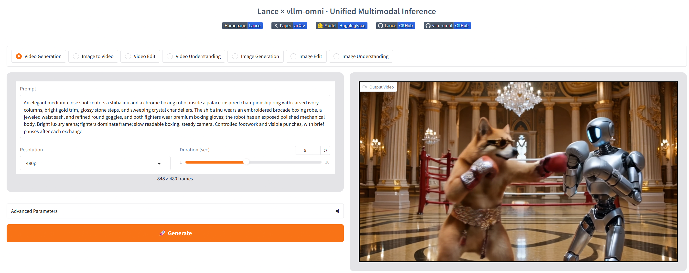

# Lance × vLLM-Omni demo



This demo provide a interactive an interactive **Gradio** UI that runs all **Lance** multimodal tasks in one place: 
- `Video Generation`
- `Image to Video`
- `Video Edit`
- `Video Understanding`
- `Image Generation` 
- `Image Edit`
- `Image Understanding`

| Path | Role |
|------|------|
| [`prepare_env.sh`](prepare_env.sh) | Clones [`vllm-omni`](https://github.com/sammysun0711/vllm-omni) on branch **`lance_demo`** into `./vllm-omni` |
| [`vllm-omni/examples/offline_inference/lance/gradio_demo.py`](vllm-omni/examples/offline_inference/lance/gradio_demo.py) | Unified Gradio app: text/image/video generation, editing, and video/image understanding. |

Upstream references: [Lance](https://github.com/bytedance/Lance) · [vLLM-Omni](https://github.com/vllm-project/vllm-omni) · [Lance on Hugging Face](https://huggingface.co/bytedance-research/Lance)

## Prerequisites

- **AMD GPU(s)** suitable for Lance inference (the demo defaults to **two logical GPUs**: image Omni + video Omni when `ulysses_degree=1` and `replicas_per_omni=1`).
- **Python environment** with this `vllm-omni`, `Gradio`, `FlashAttention`, etc.
- **Model snapshot** `--model` pointing at a **parent directory** that contains both:

  - `Lance_3B/` — image weights (t2i, image edit, image understanding)
  - `Lance_3B_Video/` — video weights (t2v, i2v, video edit, video understanding)

## Setup

1. From this directory, run:

   ```bash
   bash prepare_env.sh
   ```

## Run the Gradio demo

From the **`vllm-omni`** repo root (so imports resolve), with GPUs visible:

```bash
cd vllm-omni
export CUDA_VISIBLE_DEVICES=0,1   # at least 2 devices for default layout
python examples/offline_inference/lance/gradio_demo.py \
  --model /path/to/parent/dir/containing/Lance_3B_and_Lance_3B_Video \
  --host 0.0.0.0 \
  --port 7860
```

Useful flags (see `--help` on the script for the full list):

| Flag | Purpose |
|------|---------|
| `--replicas-per-omni N` | Scale throughput with **N** replicas per Omni (**2×N** GPUs total with default SP layout). |
| `--ulysses-degree K` | Ulysses sequence-parallel degree per Omni (**2×K** GPUs); **i2v is experimental** when `K>1` — prefer replicas for throughput. |
| `--share` | Gradio public share link. |

## Layout summary

```text
lance_demo/
  README.md                 ← this file
  prepare_env.sh            ← clone vllm-omni (branch lance_demo)
  vllm-omni/
    examples/offline_inference/lance/
      gradio_demo.py        ← main UI
      assets/
        image_to_video/     ← optional i2v first frames
        video_qa/           ← optional video-QA clips
      end2end.py            ← other offline Lance entrypoints
    …
```

## Troubleshooting

- **`Lance_3B` / `Lance_3B_Video` not found:** `--model` must be the **parent** of those two directories, not one of the leaf checkpoint folders.
- **Examples do not load media:** ensure files exist under the `assets/…` dirs above or under `--examples-root`, and restart the app after copying assets.
- **OOM or slow first run:** reduce `--replicas-per-omni`, use shorter duration in the UI for video tasks, or scale GPUs per the script’s layout rules.